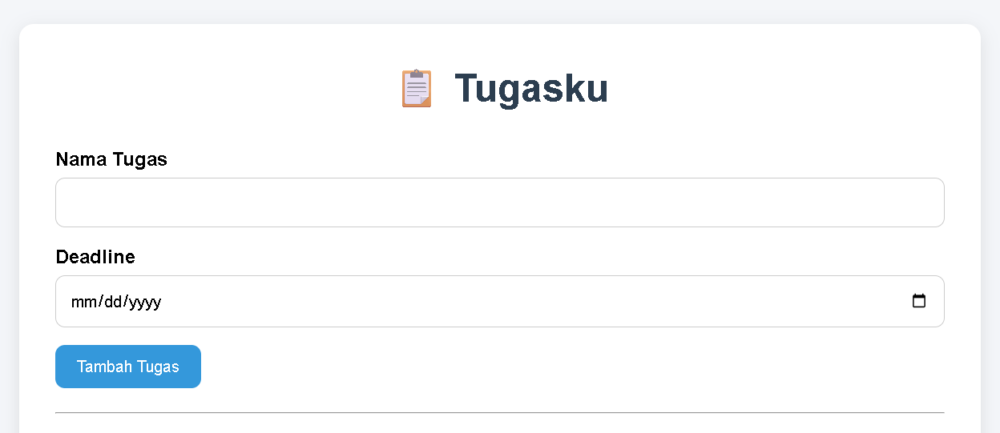
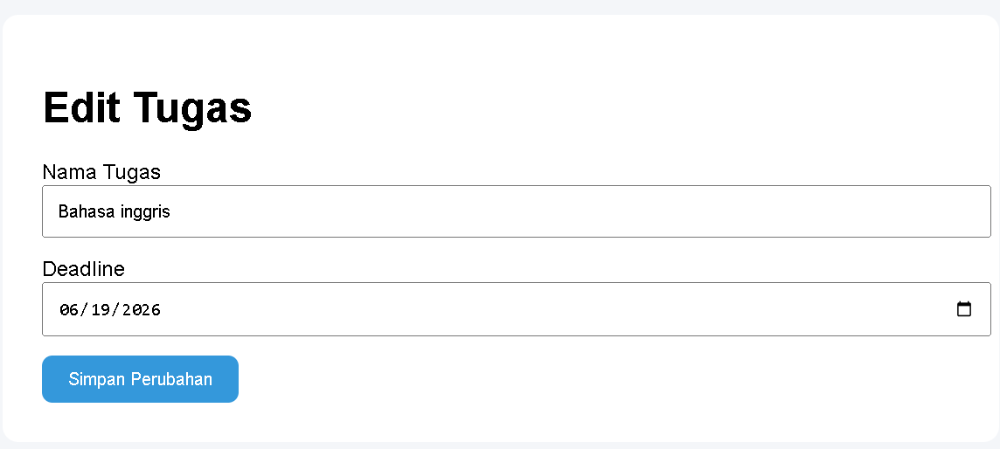
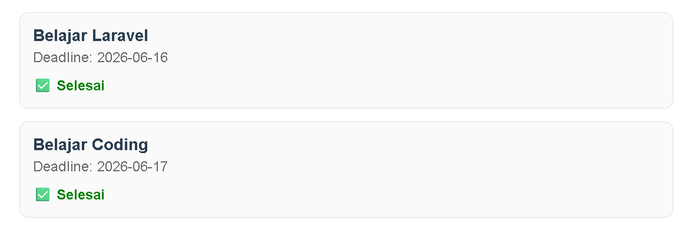
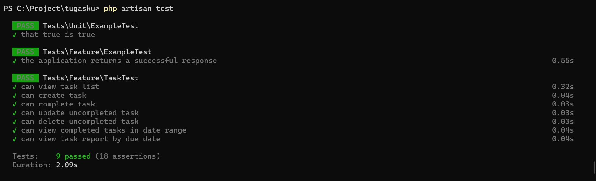

# Tugasku

Nama: Desta Andriyanto

NIM: 202359201007

## Deskripsi

Tugasku adalah aplikasi manajemen tugas berbasis web yang dibangun menggunakan framework Laravel dan database SQLite menggunakan metode Test Driven Development (TDD).

Aplikasi digunakan untuk mencatat tugas, mengatur deadline, menandai tugas selesai, mengedit dan menghapus tugas, serta menampilkan laporan tugas.

## Fitur

- Melihat daftar tugas
- Menambahkan tugas baru
- Mengedit tugas yang belum selesai
- Menghapus tugas yang belum selesai
- Menandai tugas sebagai selesai
- Melihat tugas selesai berdasarkan rentang tanggal
- Melihat laporan jumlah tugas berdasarkan tanggal deadline

## Dokumentasi

### Halaman Utama

### Edit Tugas

### Tugas Selesai

### Hasil Pengujian

## Pengujian

Aplikasi dikembangkan menggunakan metode Test Driven Development (TDD).

Hasil pengujian:

- View Task
- Create Task
- Complete Task
- Update Task
- Delete Task
- Completed Task Report
- Due Date Report

Total: 9 PASS Test

## Hak Cipta

Kode sumber aplikasi ini dibuat oleh Desta Andriyanto pada 2026 untuk mengerjakan soal UTS Pemrograman Web II.